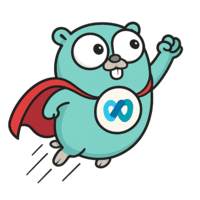

<div align="center">
    
</div>


# Webex Go SDK

A comprehensive, lightweight Go SDK for Cisco Webex API

[](https://pkg.go.dev/github.com/tejzpr/webex-go-sdk)
[](https://opensource.org/licenses/MPL-2.0)
[](https://github.com/tejzpr/webex-go-sdk)
[](https://github.com/tejzpr/webex-go-sdk/actions/workflows/go-test.yml)
[](https://github.com/tejzpr/webex-go-sdk/actions/workflows/golangci-lint.yml)
[](https://codecov.io/gh/tejzpr/webex-go-sdk)
[](https://github.com/tejzpr/webex-go-sdk/releases/latest)
[](https://goreportcard.com/report/github.com/tejzpr/webex-go-sdk)

## Implementation Status

- ✅ All REST APIs are fully implemented and working
- ⚠️ Websocket APIs are partially implemented
	- 🚧 Decryption of messages from websocket is pending implementation (help needed)

## Installation

```bash
go get github.com/tejzpr/webex-go-sdk
```

## Quick Start

```go
package main

import (
    "fmt"
    "log"
    "os"

    "github.com/tejzpr/webex-go-sdk/v1"
)

func main() {
    // Get access token from environment
    accessToken := os.Getenv("WEBEX_ACCESS_TOKEN")
    if accessToken == "" {
        log.Fatal("WEBEX_ACCESS_TOKEN environment variable is required")
    }

    // Create client
    client, err := webex.NewClient(accessToken, nil)
    if err != nil {
        log.Fatalf("Error creating client: %v", err)
    }

    // Get my own details
    me, err := client.People().GetMe()
    if err != nil {
        log.Fatalf("Error getting my details: %v", err)
    }

    fmt.Printf("Hello, %s!\n", me.DisplayName)
}
```

## Supported APIs

### REST APIs (Fully Implemented)
- **People** - Manage users in your organization
- **Messages** - Send and receive messages in rooms
- **Rooms** - Create and manage Webex rooms
- **Teams** - Create and manage Webex teams
- **Team Memberships** - Add and remove people from teams
- **Memberships** - Add and remove people from rooms
- **Webhooks** - Register for notifications
- **Attachment Actions** - Handle interactive card submissions
- **Events** - Subscribe to Webex events
- **Room Tabs** - Manage tabs in Webex rooms

### Websocket APIs (Partially Implemented)
- **Messages over Websocket** - Real-time messaging (message decryption pending)


## Examples

See the [examples](./examples) directory.

### Sending a Message

```go
message := &messages.Message{
    RoomID: "ROOM_ID",
    Text:   "Hello, World!",
}

createdMessage, err := client.Messages().Create(message)
if err != nil {
    log.Fatalf("Error sending message: %v", err)
}
fmt.Printf("Message sent: ID=%s\n", createdMessage.ID)
```

## Documentation

For detailed documentation, examples, and API reference, see:

- [Go Reference Documentation](https://pkg.go.dev/github.com/tejzpr/webex-go-sdk)
- [Examples Directory](./examples)
- [Cisco Webex API Documentation](https://developer.webex.com/docs/api/getting-started)

## Requirements

- Go 1.20 or later

## Contributing

Contributions are welcome! Please feel free to submit a Pull Request.

1. Fork the repository
2. Create your feature branch (`git checkout -b feature/amazing-feature`)
3. Commit your changes (`git commit -m 'Add some amazing feature'`)
4. Add your name to [CONTRIBUTORS.md](./CONTRIBUTORS.md) if not already present
5. Push to the branch (`git push origin feature/amazing-feature`)
6. Open a Pull Request

See [CONTRIBUTORS.md](./CONTRIBUTORS.md) for the list of contributors.

## License

This project is licensed under the Mozilla Public License 2.0 - see the [LICENSES/MPL-2.0.txt](./LICENSES/MPL-2.0.txt) file for details.


