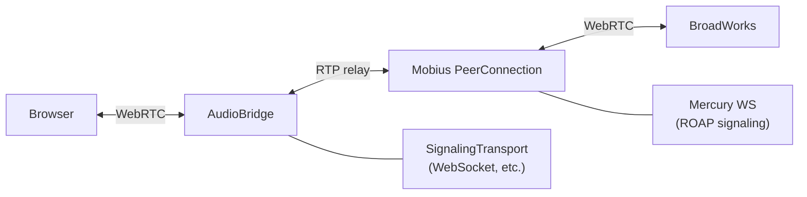

# Calling

The Calling module provides a comprehensive client for the Webex Calling APIs, including REST APIs (call history, call settings, voicemail, contacts) and real-time call control (line registration, dial, hold, transfer, DTMF) with WebRTC media via Mobius/BroadWorks signaling.

## Overview

This package covers the full Webex Calling stack:

1. **REST APIs** — Call history, call settings (DND, call waiting, call forwarding, voicemail), contacts
2. **Real-time Call Control** — Line registration with Mobius, outbound/inbound calls, hold/resume, transfer, DTMF
3. **WebRTC Media** — Pion-based PeerConnection management for Mobius, SDP munging for BroadWorks compatibility
4. **Audio Bridge** — Browser-facing WebRTC PeerConnection with bidirectional RTP relay between browser and Mobius
5. **Mercury Integration** — Automatic Mercury WebSocket wiring for Mobius call events (ROAP answers, call progress, disconnect)

## Installation

This module is part of the Webex Go SDK. To use it, import the SDK and the calling package:

```go
import (
    webex "github.com/WebexCommunity/webex-go-sdk/v2"
    "github.com/WebexCommunity/webex-go-sdk/v2/calling"
)
```

## Architecture



The SDK manages:
- **AudioBridge**: Browser-facing PeerConnection, silence keepalive, bidirectional RTP relay
- **CallingClient**: Line registration, call lifecycle, Mercury event routing, AudioBridge auto-binding
- **MediaEngine**: Mobius-facing PeerConnection, SDP munging, codec negotiation (PCMU/PCMA only)
- **Call**: Individual call state machine, ROAP signaling, Mobius HTTP API

## Usage

### Initializing the Client

```go
client, err := webex.NewClient(accessToken, nil)
if err != nil {
    log.Fatalf("Error creating client: %v", err)
}

// Access calling sub-clients
callingClient := client.Calling()
```

### REST APIs

#### Call History

```go
data, err := client.Calling().CallHistory().GetCallHistoryData(
    7,                      // days
    10,                     // limit
    calling.SortDESC,       // sort order
    calling.SortByStartTime, // sort by
)
```

#### Call Settings

```go
// Get Do Not Disturb
dnd, err := client.Calling().CallSettings().GetDoNotDisturbSetting()

// Set Do Not Disturb
dnd, err := client.Calling().CallSettings().SetDoNotDisturbSetting(true)

// Get Call Waiting
cw, err := client.Calling().CallSettings().GetCallWaitingSetting()

// Get Call Forwarding
cf, err := client.Calling().CallSettings().GetCallForwardSetting()

// Get/Set Voicemail Settings
vm, err := client.Calling().CallSettings().GetVoicemailSetting()
```

#### Voicemail

```go
// List voicemails
list, err := client.Calling().Voicemail().GetVoicemailList(0, 20, calling.SortDESC)

// Get summary
summary, err := client.Calling().Voicemail().GetVoicemailSummary()

// Mark as read/unread
_, err = client.Calling().Voicemail().MarkAsRead("MESSAGE_ID")
_, err = client.Calling().Voicemail().MarkAsUnread("MESSAGE_ID")

// Get transcript
transcript, err := client.Calling().Voicemail().GetTranscript("MESSAGE_ID")

// Delete
_, err = client.Calling().Voicemail().Delete("MESSAGE_ID")
```

#### Contacts

```go
// List contacts
contacts, err := client.Calling().Contacts().GetContacts()

// Create a contact
_, err = client.Calling().Contacts().CreateContact(calling.Contact{...})

// Create a contact group
_, err = client.Calling().Contacts().CreateContactGroup("Group Name", "", calling.GroupTypeNormal)

// Delete
_, err = client.Calling().Contacts().DeleteContact("CONTACT_ID")
_, err = client.Calling().Contacts().DeleteContactGroup("GROUP_ID")
```

### Real-Time Call Control

#### Registration

```go
// Create a CallingClient for real-time call control
cc := client.Calling().CallingClient(&calling.CallingClientConfig{
    ClientDeviceURI: "", // optional, auto-discovered via WDM
})

// Discover Mobius servers (WDM device registration + region discovery)
if err := cc.DiscoverMobiusServers(); err != nil {
    log.Fatalf("Discovery failed: %v", err)
}

// Or set Mobius servers manually
cc.SetMobiusServers([]string{"https://mobius.example.com/api/v1/calling/web/"}, nil)

// Register a line with Mobius
line, err := cc.CreateLine()
if err != nil {
    log.Fatalf("Registration failed: %v", err)
}
log.Printf("Registered: lineId=%s deviceId=%s", line.LineID, line.GetDeviceID())
```

#### Mercury Connection

Mercury delivers Mobius call events (ROAP answers, call progress, disconnect) over WebSocket. The SDK handles all wiring automatically:

```go
// Connect Mercury — uses WDM WebSocket URL from registration,
// registers wildcard handler, filters mobius.* events, routes to CallingClient
merc := client.Mercury()
if err := cc.ConnectMercury(merc); err != nil {
    log.Fatalf("Mercury failed: %v", err)
}

// Check status
if cc.IsMercuryConnected() {
    log.Println("Mercury connected")
}

// Disconnect (also called automatically by cc.Shutdown())
cc.DisconnectMercury()
```

#### Making a Call

```go
// Normalize the dial address (phone number, SIP URI, or tel: URI)
address, callType, err := calling.NormalizeAddress("+1 (408) 555-1234")
// address = "tel:+14085551234", callType = calling.CallTypeURI

call, err := cc.MakeCall(line, &calling.CallDetails{
    Type:    callType,
    Address: address,
})
if err != nil {
    log.Fatalf("Dial failed: %v", err)
}

log.Printf("Dialing: callId=%s", call.GetCallID())
```

#### Call Operations

```go
// Hold / Resume
call.Hold()
call.Resume()
call.DoHoldResume() // toggle

// Mute / Unmute
call.Mute()
call.Unmute()

// Send DTMF
call.SendDigit("5")

// Transfer (blind)
call.CompleteTransfer(calling.TransferTypeBlind, "", "+14085559999")

// Transfer (consult)
call.CompleteTransfer(calling.TransferTypeConsult, "OTHER_CALL_ID", "")

// End call
call.End()
```

#### Call Events

```go
// Listen for disconnect
call.Emitter.On(string(calling.CallEventDisconnect), func(data interface{}) {
    log.Println("Call disconnected")
})

// Listen for incoming calls on a line
cc.Emitter.On(string(calling.LineEventIncomingCall), func(data interface{}) {
    incomingCall := data.(*calling.Call)
    log.Printf("Incoming call: %s", incomingCall.GetCallID())
})
```

#### Call State

```go
call.GetCallID()        // Mobius call ID
call.GetCorrelationID() // correlation ID
call.GetDirection()     // CallDirectionOutbound or CallDirectionInbound
call.GetState()         // CallStateIdle, CallStateConnected, CallStateHeld, etc.
call.IsConnected()
call.IsMuted()
call.IsHeld()
```

### Audio Bridge

The AudioBridge manages a browser-facing WebRTC PeerConnection and bidirectional RTP relay between the browser and Mobius. It handles:

- PCMU/PCMA codec negotiation (matching Mobius)
- Silence keepalive to prevent browser PC timeout
- Browser→Mobius RTP relay (gated on Mobius PC connection)
- Mobius→Browser RTP relay (starts when Mobius remote track arrives)

#### Creating an AudioBridge

```go
bridge, err := calling.NewAudioBridge(nil) // uses default config (Google STUN)
if err != nil {
    log.Fatalf("Failed to create audio bridge: %v", err)
}
defer bridge.Close()

// Or with custom config
bridge, err := calling.NewAudioBridge(&calling.AudioBridgeConfig{
    ICEServers: []webrtc.ICEServer{
        {URLs: []string{"stun:stun.example.com:3478"}},
    },
})
```

#### Auto-Binding with CallingClient

Register the bridge with CallingClient for automatic attach/detach on call lifecycle:

```go
cc.SetAudioBridge(bridge)
// Now MakeCall() automatically attaches the bridge, and
// call disconnect automatically detaches it.

// Clear when done
cc.ClearAudioBridge()
```

#### WebRTC Signaling

The `SignalingTransport` interface abstracts the signaling channel (WebSocket, gRPC, HTTP polling, etc.):

```go
// Implement SignalingTransport for your transport
type wsTransport struct{ conn *websocket.Conn }

func (t *wsTransport) ReadMessage() ([]byte, error) {
    _, data, err := t.conn.ReadMessage()
    return data, err
}
func (t *wsTransport) WriteMessage(data []byte) error {
    return t.conn.WriteMessage(websocket.TextMessage, data)
}

// HandleSignaling blocks until the transport closes
err := bridge.HandleSignaling(&wsTransport{conn: wsConn})
```

The signaling protocol uses JSON messages:

| Type | Direction | Fields |
|------|-----------|--------|
| `offer` | Browser → Server | `type`, `sdp` |
| `answer` | Server → Browser | `type`, `sdp` |
| `ice-candidate` | Both directions | `type`, `candidate` |

#### Manual Signaling (Advanced)

If you need more control over the signaling flow:

```go
pc := bridge.PeerConnection()

// Set callbacks
bridge.OnICECandidate(func(c *webrtc.ICECandidate) {
    // Send candidate to browser
})
bridge.OnConnectionStateChange(func(state webrtc.PeerConnectionState) {
    log.Printf("Browser PC state: %s", state)
})

// Manually attach/detach calls
bridge.AttachCall(call)
bridge.DetachCall()
```

### Shutdown

```go
// Shutdown deregisters all lines, disconnects Mercury, clears AudioBridge
cc.Shutdown()

// Or clean up stale devices from previous sessions
deleted, err := cc.DeregisterAllDevices()
log.Printf("Cleaned up %d stale devices", deleted)
```

## Data Structures

### Key Types

| Type | Description |
|------|-------------|
| `CallingClient` | Main orchestrator for lines, calls, Mercury, and AudioBridge |
| `Line` | Represents a registered line with Mobius |
| `Call` | Represents an active call with state machine and media |
| `AudioBridge` | Browser-facing WebRTC PeerConnection with RTP relay |
| `MediaEngine` | Mobius-facing WebRTC PeerConnection with SDP munging |

### Call States

| State | Description |
|-------|-------------|
| `CallStateIdle` | Initial state before dialing |
| `CallStateAlerting` | Ringing (incoming) or proceeding (outgoing) |
| `CallStateConnected` | Call is active with media flowing |
| `CallStateHeld` | Call is on hold |
| `CallStateDisconnected` | Call has ended |

### Call Events

| Event | Description |
|-------|-------------|
| `CallEventAlerting` | Call is ringing |
| `CallEventConnect` | Call connected |
| `CallEventDisconnect` | Call ended |
| `CallEventHeld` | Call placed on hold |
| `CallEventResumed` | Call resumed from hold |
| `CallEventRemoteMedia` | Remote media (SDP answer) received |

### Line Events

| Event | Description |
|-------|-------------|
| `LineEventConnecting` | Line registration in progress |
| `LineEventRegistered` | Line registered successfully |
| `LineEventUnregistered` | Line deregistered |
| `LineEventIncomingCall` | Incoming call on this line |

### Address Normalization

`NormalizeAddress()` handles all address formats:

| Input | Output | Call Type |
|-------|--------|-----------|
| `+1 (408) 555-1234` | `tel:+14085551234` | `CallTypeURI` |
| `tel:+14085551234` | `tel:+14085551234` | `CallTypeURI` |
| `sip:user@example.com` | `sip:user@example.com` | `CallTypeURI` |

## Complete Example

Here's a complete example demonstrating registration, Mercury connection, audio bridge setup, and making a call:

```go
package main

import (
    "log"
    "os"

    "github.com/gorilla/websocket"

    webex "github.com/WebexCommunity/webex-go-sdk/v2"
    "github.com/WebexCommunity/webex-go-sdk/v2/calling"
)

func main() {
    accessToken := os.Getenv("WEBEX_ACCESS_TOKEN")
    if accessToken == "" {
        log.Fatal("WEBEX_ACCESS_TOKEN required")
    }

    // 1. Create Webex client
    client, err := webex.NewClient(accessToken, nil)
    if err != nil {
        log.Fatalf("Client error: %v", err)
    }

    // 2. Create CallingClient and discover Mobius
    cc := client.Calling().CallingClient(&calling.CallingClientConfig{})
    if err := cc.DiscoverMobiusServers(); err != nil {
        log.Fatalf("Discovery failed: %v", err)
    }

    // 3. Register a line
    line, err := cc.CreateLine()
    if err != nil {
        log.Fatalf("Registration failed: %v", err)
    }
    log.Printf("Registered: lineId=%s deviceId=%s", line.LineID, line.GetDeviceID())

    // 4. Connect Mercury for call events
    go func() {
        if err := cc.ConnectMercury(client.Mercury()); err != nil {
            log.Printf("Mercury failed: %v", err)
        }
    }()

    // 5. Create AudioBridge and register with CallingClient
    bridge, err := calling.NewAudioBridge(nil)
    if err != nil {
        log.Fatalf("AudioBridge error: %v", err)
    }
    defer bridge.Close()
    cc.SetAudioBridge(bridge)

    // 6. Handle browser WebSocket signaling (in your HTTP handler)
    // bridge.HandleSignaling(&yourWSTransport{conn: wsConn})

    // 7. Make a call (AudioBridge auto-attaches)
    address, ct, _ := calling.NormalizeAddress("+14085551234")
    call, err := cc.MakeCall(line, &calling.CallDetails{
        Type:    ct,
        Address: address,
    })
    if err != nil {
        log.Fatalf("Dial failed: %v", err)
    }
    log.Printf("Call started: %s", call.GetCallID())

    // 8. Listen for events
    call.Emitter.On(string(calling.CallEventDisconnect), func(d interface{}) {
        log.Println("Call disconnected")
    })

    // 9. Cleanup
    // cc.Shutdown() // deregisters lines, disconnects Mercury, clears bridge
}
```

## Error Handling

All methods return structured errors from the `webexsdk` package. Use the convenience functions to check error types:

```go
history, err := client.Calling().GetCallHistory(nil)
if err != nil {
    switch {
    case webexsdk.IsAuthError(err):
        log.Println("Invalid or expired access token")
    case webexsdk.IsRateLimited(err):
        log.Println("Rate limited — SDK retries automatically")
    case webexsdk.IsServerError(err):
        log.Println("Server error — SDK retries automatically")
    default:
        log.Printf("Error: %v", err)
    }
}
```

See [webexsdk/Readme.md](../webexsdk/Readme.md) for the full error type reference.

## Related Resources

- [Webex Calling API Documentation](https://developer.webex.com/docs/api/v1/call-controls)
- [Webex Call History API](https://developer.webex.com/docs/api/v1/call-history)
- [Webex Call Settings API](https://developer.webex.com/docs/api/v1/user-call-settings)
- [Webex Voicemail API](https://developer.webex.com/docs/api/v1/voicemail)
- [Webex Contacts API](https://developer.webex.com/docs/api/v1/contacts)
- [Pion WebRTC](https://github.com/pion/webrtc)
